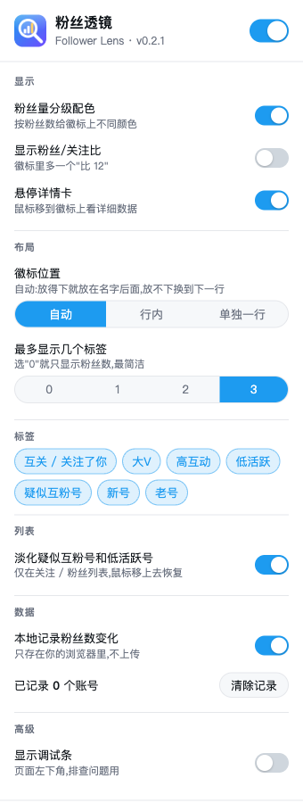

<p align="center"></p>

# 粉丝透镜 Follower Lens

一个 Chrome 扩展:在 X(Twitter)的信息流和关注列表里,直接在用户名旁边显示**粉丝数**,并给出几个帮你判断账号质量的标签。

X 不直接展示别人的粉丝数。看到一个陌生账号,想知道它值不值得关注,得点进主页才行。这个扩展把这一步省掉了。

## 效果

用户名后面会多出一个徽标:

```
Andy L ✓ @AndyL5cc · 1小时  [9284 粉丝]
某账号 ✓ @example · 3小时   [52万 粉丝] [互关] [大V] [高互动]
```

- **分级配色**:按粉丝量上色(灰 < 1千 < 蓝 < 1万 < 绿 < 10万 < 橙 < 100万 < 红),一眼分出量级。
- **悬停详情卡**:鼠标移到徽标上,显示精确粉丝数、关注数、粉丝/关注比、推文数、注册时间、互动率,以及你们的关系。
- **粉丝数变化**:本地记录你刷到过的账号,悬停卡里显示"近 7 天 +320 (+1.2%)"。记录只存在你的浏览器里,第二天起开始显示变化。
- **互关 / 关注了你**:一眼看出谁关注了你、哪些是互关。在别人的"关注者"页、你自己的"关注者"页尤其有用。
- **列表里淡化低质量账号**:关注 / 粉丝列表里,疑似互粉号和低活跃号会变淡,鼠标移上去恢复,帮你更快找到值得关注的人。
- 粉丝数 1 万以内显示精确数字,超过 1 万用"万"、"亿"。
- **自适应布局**:推文头部那一行很挤(名字、@ID、时间,再加上你装的其它插件的小标)。默认的"自动"模式下,徽标能放在名字后面就放,放不下(名字会被挤省略)就自动换到下一行,不会把名字挤坏。也可以固定成"行内"或"单独一行"。
- **标签数量可调**:徽标里最多显示几个标签,可选 0~3 个。选 0 就只剩粉丝数,最简洁。
- 右侧"推荐关注"栏地方窄,只显示粉丝数,不显示标签。

## 设置

点浏览器工具栏里的"粉丝透镜"图标,打开设置面板。所有改动**即时生效**,不用刷新页面。

<p align="center"></p>

可以调整:徽标位置(自动 / 行内 / 单独一行)、最多显示几个标签,单独开关分级配色、粉丝/关注比、悬停详情卡、每一种标签、列表淡化、历史记录,也可以一键清除历史记录。

## 质量标签

徽标默认最多显示 3 个标签(可在设置里改),按下面的顺序优先。

| 标签 | 含义 |
|---|---|
| 互关 / 关注了你 | 你们互相关注 / 对方关注了你但你没回关 |
| 大V | 粉丝 ≥ 1 万,且粉丝/关注比 ≥ 10 |
| 疑似互粉号 | 关注 ≥ 1000,粉丝/关注比接近 1,粉丝 < 5000 |
| 新号 | 注册不到 90 天 |
| 高互动 | 互动率 ≥ 3%(点赞+转推+回复+引用 ÷ 浏览量) |
| 低活跃 | 互动率 < 0.1%,且粉丝 ≥ 5000 |
| 老号 | 注册超过 8 年 |

说明:
- 互动率是用你**刷到过的**该账号推文累计算出来的,所以刷得越多越准。浏览量合计不足 2000 时不判断互动率。
- 阈值是经验值,不是标准答案。想调的话,改 [parse.js](parse.js) 里的 `tags` 函数。
- 标签只是辅助参考,粉丝数多少不代表内容质量。

## 安装

目前没有上架 Chrome 应用商店,用"加载已解压的扩展程序"安装:

1. 下载本仓库(绿色 Code 按钮 → Download ZIP),解压。
2. 在 Chrome 地址栏打开 `chrome://extensions`。
3. 打开右上角的**开发者模式**。
4. 点**加载已解压的扩展程序**,选择解压后的文件夹(里面有 `manifest.json` 的那一层)。
5. 打开或刷新 x.com(`Cmd+Shift+R` / `Ctrl+Shift+R` 强制刷新)。

如果之前装过旧版,在扩展页面点它的刷新按钮,并强制刷新 x.com。

## 使用

装好后不需要任何操作,正常刷 X 就行:

- **信息流**:每条推文的用户名后面会出现徽标。
- **关注列表**:打开某人的"正在关注"或"关注者"页,每个用户行里会出现徽标。这也是最适合"看别人关注了谁,找新账号"的用法。
- 如果徽标没出现,在设置面板里打开"显示调试条",页面左下角会出现"数据包 / 用户 / 已显示"三个数字:
  - 用户数一直是 0:X 的数据结构变了,读不到粉丝数。
  - 用户数大于 0、已显示是 0:页面结构变了,徽标没地方放。
- 只有已经载入数据的账号才有徽标,所以向下滚动时,新出现的推文会稍晚一点才显示。

## 它是怎么工作的

X 的网页自己会向服务器请求数据,这些响应里本来就包含用户的粉丝数、关注数和注册时间。插件只是**读取页面已经收到的这些响应**,然后把数字显示出来。

- 不调用 X 的官方 API,不需要登录授权、不需要 API Key。
- **不主动发出任何网络请求**,也不会把任何数据发送到别处。设置和粉丝数历史记录只保存在你浏览器的本地存储里(`chrome.storage.local`),可随时在设置面板里清除。
- 只在 `x.com` 和 `twitter.com` 上运行。

## 文件说明

| 文件 | 作用 |
|---|---|
| [manifest.json](manifest.json) | 扩展配置 |
| [inject.js](inject.js) | 在页面里截取 X 自己发出的数据响应(只读) |
| [parse.js](parse.js) | 从响应里提取用户信息,并判断质量标签 |
| [content.js](content.js) | 把徽标、悬停卡插到页面上,记录历史 |
| [content.css](content.css) | 徽标和悬停卡样式 |
| [popup.html](popup.html) / [popup.js](popup.js) / [popup.css](popup.css) | 设置面板 |
| [icons/](icons) | 图标(`icon.svg` 是源文件) |

## 已知限制

- 依赖 X 网页内部的数据结构和页面元素。X 改版后可能失效,修复通常只需要改 `parse.js`(数据字段)或 `content.js`(页面位置)。
- 目前只支持桌面版 Chrome(及基于 Chromium 的浏览器,如 Edge)。
- 粉丝数变化只能从你**第一次刷到**这个账号开始记录,不会有更早的历史。

## 后续计划

- 关注列表页的真正排序和筛选(X 的列表是虚拟滚动,目前只做了淡化)。
- 在自己的"关注者"页,把有影响力的新关注者汇总成一份列表。
- 导出刷到过的账号数据(CSV)。
- 上架 Chrome 应用商店。

## 免责声明

本项目以 [MIT 协议](LICENSE) 开源。这是个人开发的非官方工具,与 X Corp. 无关。X 的服务条款可能限制对页面数据的自动化处理,请自行评估并承担使用风险。
